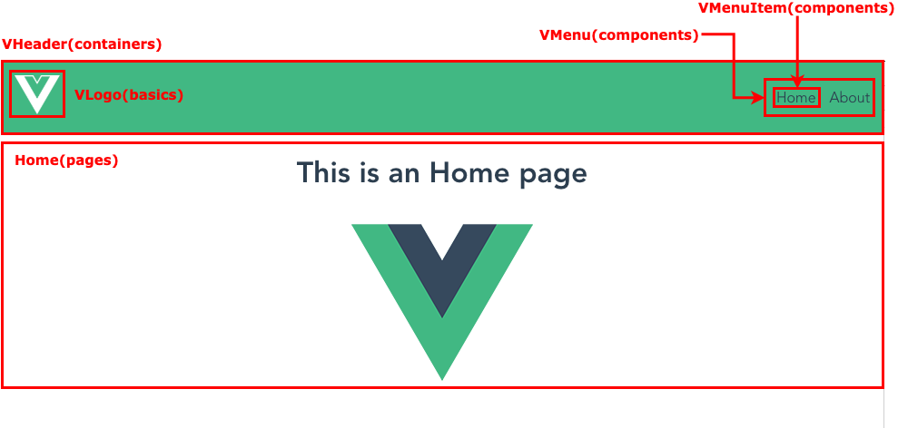

# 001

コンポーネントを格納するディレクトリを以下のように分けたパターン。

- `basics`
- `components`
- `containers`
- `pages`

## 各ディレクトリの詳細（TODO）

TODO

## サンプルページで利用されているコンポーネントの分類

今回のサンプルページで利用されているコンポーネントの分類は以下の通り。



## Project setup
```
yarn install
```

### Compiles and hot-reloads for development
```
yarn run serve
```

### Compiles and minifies for production
```
yarn run build
```

### Run your tests
```
yarn run test
```

### Lints and fixes files
```
yarn run lint
```

### Customize configuration
See [Configuration Reference](https://cli.vuejs.org/config/).
