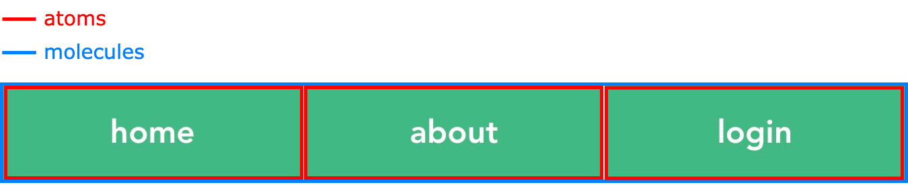

# 003

Atomic Design の Molecules に属するユニークな Atoms の扱いはどうするのか問題に関して。

## はじめに

以下のような Atomic Design の Molecules にあたるコンポーネントがあるとする。



このコンポーネントのVueファイルは以下のようになる。

`VMenu.vue`

```html
<template>
  <div class="v-menu">
    <a
      class="v-menu-item"
      v-for="(item, index) in items"
      :key="index"
      :style="{ width: menuItemWidth }"
      :href="item.href"
    >
      {{ item.text }}
    </a>
  </div>
</template>

<script>
export default {
  name: "VMenu",
  props: {
    items: {
      type: Array,
      default: () => []
    }
  },
  computed: {
    menuItemWidth() {
      return `calc(100% / ${this.items.length})`;
    }
  }
};
</script>

<style scoped>
  /* 割愛... */
</style>
```

このコンポーネントの Atoms にあたる以下を別の Vue ファイルに切り出したい状況になったとする。

```html
<a
  class="v-menu-item"
  v-for="(item, index) in items"
  :key="index"
  :style="{ width: menuItemWidth }"
  :href="item.href"
>
  {{ item.text }}
</a>
```

切り出したい Atoms はこの Molecules 専用の Atoms のため、切り出した Vue ファイルをどこに格納すれば良いのか無茶苦茶悩む。

いくつかパターンを考えたので、それに関して書き記しておく。

結論から言っておくとあまり良いものはなかったので、状況や決めの問題だと思った。

## パターン1

```
.
└── components
    └── molecules
        ├── VMenu2.vue
        └── VMenu2Item.vue
```

`molecules`ディレクトリに`VMenu2.vue`の Atoms である`VMenu2Item.vue`を格納するパターン。

**`molecules`ディレクトリに Atoms が入っているのはおかしいのでボツ。**

## パターン2

```
.
└── components
    └── molecules
        └── VMenu3
            ├── VMenu3.vue
            └── VMenu3Item.vue
```

`molecules`ディレクトリからさらに`VMenu3`ディレクトリを切ってそこに`VMenu3.vue`とその Atoms である`VMenu3Item.vue`を格納するパターン。

まあわかりやすい。けどやっぱり`molecules`ディレクトリに Atoms があるのはどーなのよとは若干思う。

また、`VMenu3Item.vue`を他の Molecules でも利用したくなった場合、どーすんのよと思った（積みそう）。

## パターン3

```
.
└── components
    ├── atoms
    │   └──  VMenu4Item.vue
    └── molecules
        └── VMenu4.vue
```

Atoms を `atoms`ディレクトリに格納するパターン。

`VMenu4.vue`の Atoms であることがわかりづらい。

また、利用を想定していない Molecules で利用されてしまいそう。

**何も良いことがないのでボツ。**

## パターン4

```
.
└── components
    ├── atoms
    │   └── molecules
    │       └── VMenu5
    │           └── VMenu5Item.vue
    └── molecules
        └── VMenu5.vue
```

`atoms`ディレクトリからさらに`molecules`ディレクトリと`VMenu5`ディレクトリを切ってそこに`VMenu5Item.vue`を格納するパターン。

どの Molecules の Atoms なのかというのはわかりやすい。

しかし、冗長。また`atoms`ディレクトリの中に`molecules`ディレクトリを切るのはどうなのよと思う。

## パターン5

参考: [DMM動画サービスの問題を解決しようとしている話（コンポーネント編）](https://inside.dmm.com/entry/2018/07/12/components)

```
.
└── components
    ├── atoms
    │   └── menus
    │       └── menuItem
    │           └── VMenuItem.vue
    └── molecules
        └── menus
            └── menu
                └── VMenu.vue
```

`components/atoms/menus/menuItem`のように、`/components/粒度/カテゴリ/コンポーネント名`で分けるパターン。

~~ディレクトリの階層が深くなるが、中規模以上のアプリケーションであれば、これが一番使いやすいのではないかと思った。~~

※実際に使ってみたらコンポーネントを探すのが無茶苦茶大変だった。

小規模なアプリケーションであれば。ここまでする必要はないと思う。

## パターン6

参考: [Vue.js × Atomic Design - コンポーネント分割の指針 / Vue.js and Atomic Design - Guideline for components division](https://speakerdeck.com/nrslib/vue-dot-js-and-atomic-design-guideline-for-components-division)

```
.
├── App.vue
└── components
    ├── atoms
    │   └── menu
    │       └── VMenuItem.vue
    └── molecules
        └── menu
            └── VMenu.vue
```

- `components/atoms/menu/VMenuItem.vue`
- `components/molecules/menu/VMenu.vue`
  
のように、`/components/粒度/カテゴリ/コンポーネント名`で分けるパターン。

これで良いんじゃないかなと思った。

## 総括

パターン6が良いんじゃないのかーと思った。

## Project setup
```
yarn install
```

### Compiles and hot-reloads for development
```
yarn run serve
```

### Compiles and minifies for production
```
yarn run build
```

### Run your tests
```
yarn run test
```

### Lints and fixes files
```
yarn run lint
```

### Customize configuration
See [Configuration Reference](https://cli.vuejs.org/config/).
